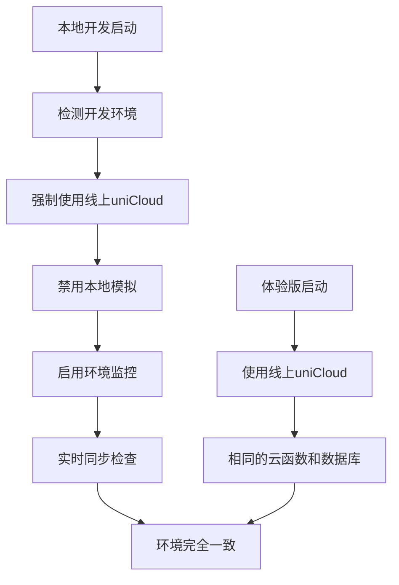

# 🚀 环境一致性快速配置指南

## 📋 一分钟快速配置

### 1. 立即生效的配置

项目已经自动集成环境一致性管理！重新启动开发服务器即可生效：

```bash
# 重启开发服务器
npm run dev
# 或在HBuilderX中重新运行
```

### 2. 检查环境状态

在浏览器开发者工具控制台查看日志：

```
✅ 如果看到这些日志说明配置成功：
🔧 开发环境启用线上一致性模式
✅ 已禁用本地云函数模拟  
✅ 已配置强制使用线上数据库
✅ 环境监控已启动
✅ 环境状态检查通过
```

### 3. 云函数部署（重要！）

**必须完成这一步才能真正解决环境一致性问题**：

1. **在HBuilderX中**：
   - 右键 `uniCloud-aliyun/cloudfunctions` 
   - 选择 "上传所有云函数"
   - 等待上传完成

2. **初始化数据库**：
   - 在HBuilderX云函数控制台
   - 调用 `db-init` 函数
   - 参数：`{"action": "init"}`

### 4. 验证环境一致性

**开发环境测试**：
- 打开房间列表页面
- 查看是否能正常加载数据
- 控制台应显示正在调用线上云函数

**体验版测试**：
- 上传体验版
- 测试相同功能
- 应该与开发环境表现一致

## 🔧 工作原理

### 环境强制一致化



### 自动化检查机制

- ✅ **连接检查**：自动验证uniCloud连接
- ✅ **部署检查**：检查云函数是否已部署
- ✅ **数据库检查**：验证数据库表是否初始化
- ✅ **实时监控**：每30秒检查环境状态
- ✅ **错误告警**：发现问题立即提示

## 📊 环境状态监控

### 实时查看环境状态

在任意页面的控制台运行：

```javascript
// 查看环境信息
import('./utils/env-manager.js').then(({ getCurrentEnv }) => {
  const env = getCurrentEnv();
  console.log('当前环境:', env);
});

// 执行完整环境检查
import('./utils/env-manager.js').then(async ({ EnvironmentChecker }) => {
  const checker = new EnvironmentChecker();
  const result = await checker.performFullCheck();
  console.log('环境检查结果:', result);
});
```

### 环境同步报告

```javascript
// 查看同步状态报告
import('./utils/development-parity.js').then(({ getParityManager }) => {
  const manager = getParityManager();
  if (manager) {
    console.log('同步报告:', manager.getSyncReport());
  }
});
```

## 🚨 问题排查

### 常见问题及解决方案

#### ❌ "云函数未部署"错误
```bash
解决方案：
1. 在HBuilderX中上传所有云函数
2. 确认上传成功
3. 重新启动开发服务器
```

#### ❌ "数据库连接失败"
```bash
解决方案：
1. 调用 db-init 云函数初始化数据库
2. 检查 spaces.json 配置是否正确
3. 确认服务空间绑定的AppID正确
```

#### ❌ "环境检查失败"
```bash
解决方案：
1. 查看控制台错误详情
2. 运行环境检查命令获取具体问题
3. 根据错误提示逐项修复
```

### 调试命令

```javascript
// 1. 基础连接测试
uniCloud.callFunction({
  name: 'db-init',
  data: { action: 'ping' }
}).then(res => console.log('✅ 连接正常:', res))
  .catch(err => console.error('❌ 连接失败:', err));

// 2. 环境信息诊断
console.log('uniCloud对象:', typeof uniCloud);
console.log('当前平台:', uni.getSystemInfoSync().platform);

// 3. 手动触发环境同步
import('./utils/development-parity.js').then(async ({ checkAutoDeployment }) => {
  const result = await checkAutoDeployment();
  console.log('部署检查结果:', result);
});
```

## 🎯 成功标志

### ✅ 配置成功的标志

1. **控制台日志正常**：
   - 看到环境一致性初始化成功的日志
   - 没有错误或警告信息

2. **功能表现一致**：
   - 开发环境和体验版数据加载一致
   - 相同操作产生相同结果

3. **环境检查通过**：
   - 环境状态检查显示全部正常
   - 云函数部署状态为已部署

### 📈 预期改善效果

- ✅ **消除环境差异**：本地和线上表现完全一致
- ✅ **提高开发效率**：减少环境问题调试时间
- ✅ **降低发布风险**：发布前问题提前发现
- ✅ **自动化运维**：环境问题自动检测和提醒

## 🔄 持续优化

### 定期维护

1. **每周检查**：
   - 运行完整环境检查
   - 查看同步报告
   - 处理积累的警告

2. **版本发布前**：
   - 执行完整的环境验证
   - 确认所有云函数已同步
   - 验证关键功能正常

3. **团队协作**：
   - 统一环境配置标准
   - 共享环境问题解决方案
   - 持续改进开发工具链

通过以上配置，你的项目现在具备了完整的环境一致性保障机制！🎉